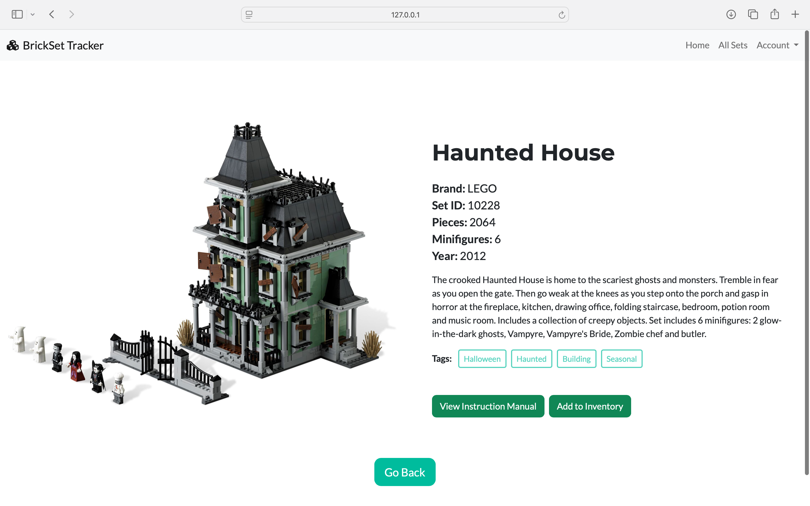

# BrickSet Tracker

A simple Flask app where users can collect Brick sets, view details, and manage their own collection.

## Features
- User registration & login (Flask-Login)
- Add / edit / delete brick sets and brands (admin only)
- Users can collect and manage their sets

## Screenshots
Here are a some preview shots of the web app.

### Home / Set list View
<div align="center">


<p>Once logged in, users see some statistics showing the total number of sets they own and the overall piece count.</p>

</div>

### Owned Sets Page
<div align="center">

</div>

### Sets Detail Page
<div align="center">

</div>

# Sample Database
The sample.db has been pre-loaded with data, so you don't need to set up your own database.
It has some brick brands and sets added and a user with an editor role. 
The example sets are sourced from [Rebrickable's Free LEGO Catalog Database](https://rebrickable.com/downloads/).

- Username: test
- Password: 1234

## Tech
- Python + Flask + SQLAlchemy
- PostgreSQL (SQLite fallback)
- HTML with Jinja2 templates
- Bootstrap5 with the [Freelancer theme](https://github.com/startbootstrap/startbootstrap-freelancer)
- RESTful API (Flask-RESTful)

## Setup
1. Clone this repo
    ```bash
    git clone https://github.com/RobertLippai/brickset_tracker.git
    cd brickset-tracker
    ```

2. Create a virtual environment & install dependencies:
    ```bash
    python -m venv venv
    source venv/bin/activate
    pip install -r requirements.txt
    ```

3. Configure environment variables
- Copy the example file:
    ```bash
    cp .env.example .env
    ```
- Fill in the variables inside .env file.

- If you’re using PostgreSQL, make sure your DB is set up and the URI is correct.
If no SQLALCHEMY_DATABASE_URI is provided, the app will automatically use a local SQLite database!

4. Run the app
    ```bash
    flask run
    ```

## To Do
- Add searching by tags
- Add proper input validation and visible error messages for forms
- Redesign editor page
- Create editor page for adding tags
- Replace Flask-Login with JWT
- Create a standalone frontend

> 🎯 **Goal:** Transform the app into a proper REST API backend by using JWT and moving all frontend logic to a separate app.


## Credits
- Mourizal Zativa -- bricks_1.jpeg: [Link](https://unsplash.com/photos/blue-red-and-yellow-lego-blocks-OSvN1fBcXYE)
- Xavi Cabrera -- bricks_2.jpeg: [Link](https://unsplash.com/photos/yellow-red-blue-and-green-lego-blocks-kn-UmDZQDjM)

    Note: The LEGO sets, as well as those from other brands like Lumibricks (Previously Funwhole) and Pantasy, shown in the screenshots are used for illustrative purposes only. They are not part of the app's functionality. This project is intended to showcase my work, and no copyright infringement is intended.