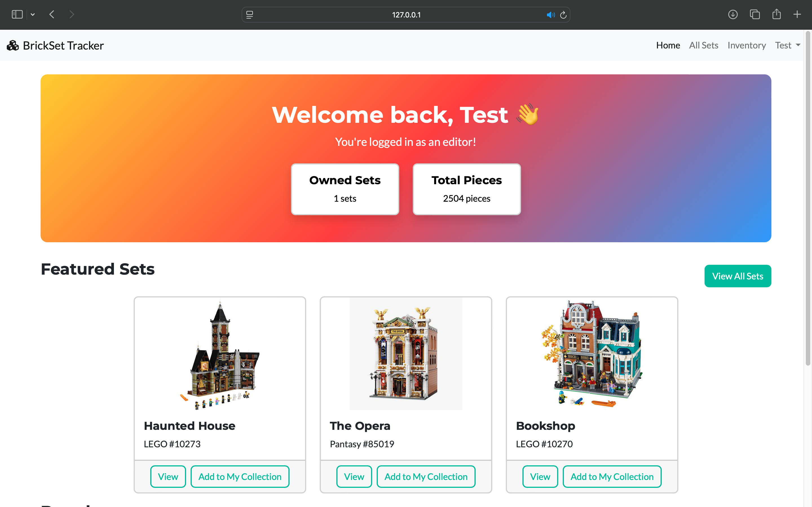

# BrickSet Tracker

A simple Flask app where users can collect Brick sets, view details, and manage their own collection.

## Features
- User registration & login (Flask-Login)
- Add / edit / delete brick sets and brands (admin only)
- Users can collect and manage their sets

## Screenshots
Here are a some preview shots of the web app.

### Home / Set list View
<div align="center">


</div>

### Owned Sets Page
<div align="center">

</div>

## Tech
- Python + Flask + SQLAlchemy
- PostgreSQL (SQLite fallback)
- HTML with Jinja2 templates
- Bootstrap5 with the [Freelancer theme](https://github.com/startbootstrap/startbootstrap-freelancer)
- RESTful API (Flask-RESTful)

## Setup
1. Clone this repo
    ```bash
    git clone https://github.com/RobertLippai/brickset_tracker.git
    cd brickset-tracker
    ```

2. Create a virtual environment & install dependencies:
    ```bash
    python -m venv venv
    source venv/bin/activate
    pip install -r requirements.txt
    ```

3. Configure environment variables
- Copy the example file:
    ```bash
    cp .env.example .env
    ```
- Fill in the variables inside .env file.

- If you’re using PostgreSQL, make sure your DB is set up and the URI is correct.
If no SQLALCHEMY_DATABASE_URI is provided, the app will automatically use a local SQLite database!

4. Run the app
    ```bash
    flask run
    ```

## To Do
- Add HTML page for viewing set details
- Add proper input validation and visible error messages for forms
- Display images of the given brick set
- Replace Flask-Login with JWT
- Create a standalone frontend

> 🎯 **Goal:** Transform the app into a proper REST API backend by using JWT and moving all frontend logic to a separate app.


## Credits
- Mourizal Zativa -- bricks_1.jpeg: [Link](https://unsplash.com/photos/blue-red-and-yellow-lego-blocks-OSvN1fBcXYE)
- Xavi Cabrera -- bricks_2.jpeg: [Link](https://unsplash.com/photos/yellow-red-blue-and-green-lego-blocks-kn-UmDZQDjM)